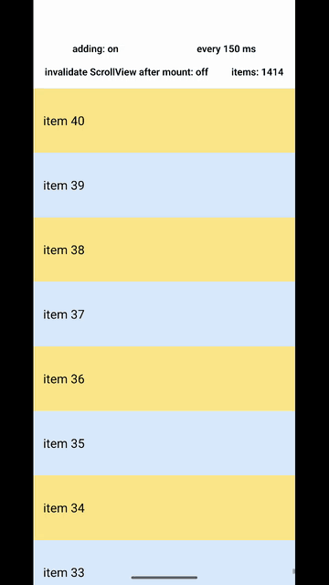
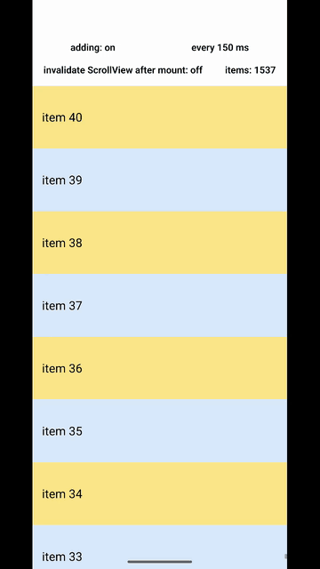

# MVCP one-frame jump on prepend (Android, Fabric), minimal reproduction

A minimal [Expo](https://expo.dev) / [React Native](https://reactnative.dev) project that reproduces a `maintainVisibleContentPosition` (MVCP) glitch on Android with the New Architecture.

The glitch was first observed in a chat app that uses [LegendList](https://github.com/LegendApp/legend-list) 3. It has been traced down to a plain `ScrollView` with this setup:

- `maintainVisibleContentPosition={{ minIndexForVisible: 0 }}`
- child 0 of the content is a 0x0 view at `top: 1e7 + adjust` (the MVCP anchor)
- child 1 is a wrapper with the total height that holds absolutely positioned items
- on a prepend, the items and the anchor move in one React commit
- the wrapper height is an `Animated.Value`, so it reaches native in a separate update

No list library is used in the repro.

## The bug

The `ScrollView` receives a new item at the top. For one frame the visible rows move down by the height of that item. In the next frame they move back. In the chat app this happens on every incoming message.

- **Environment:** Expo 57, React Native 0.86.3, New Architecture, Android. Pixel 9 Pro emulator, API 36. Not seen on iOS.
- **Symptom:** launch the app. One item is added at the top every 150 ms. The rows shake on almost every insert




### Suspected root cause

Two native updates land in different frames:

1. The content container grows (mount X). Nothing moves.
2. The items and the anchor move, and `MaintainVisibleScrollPositionHelper.didMountItems` calls `scrollTo` (mount Y).

In mount Y, Fabric moves each item view with `View.layout`. Each moved view calls `invalidate()` on itself, which marks that view and its ancestors in the Android View hierarchy as dirty and asks `ViewRootImpl` to draw in the current frame. The ScrollView itself is only marked dirty, so its display list is reused, not recorded again. `scrollTo` on the ScrollView calls `postInvalidateOnAnimation`, which schedules the new recording for the next frame. The reused display list still holds `translate(-oldScrollY)`. The current frame draws the new item positions against the old scroll offset. The next frame records the display list again and the rows move back.

When the content container changes size in the same mount as the moves, the layout pass invalidates the ScrollView and the display list is recorded again in time. This is why plain flex children never jump, and why a plain style height never jumps.  LegendList sets its container height through an `Animated.Value` (`src/components/Containers.native.tsx`), so the height reaches native before the commit that moves the items

A native probe (`UIManagerListener` plus `OnPreDrawListener`) showed that the View state is correct at every draw: `scrollY` and the child positions match when the frame is drawn. The stale frame is inside HWUI, in the display list

### Fix

Call `scrollView.invalidate()` after each `scrollToPreservingMomentum` in `MaintainVisibleScrollPositionHelper.updateScrollPositionInternal`. The display list is then recorded again with the corrected scroll offset in the same frame.

The local Expo module `modules/scroll-view-invalidation` demonstrates the effect without a patch to React Native. It registers a `UIManagerListener` (experimental API) and invalidates every `ReactScrollView` in `didMountItems`. It is not the patch itself. The `invalidate ScrollView after mount: on/off` button toggles it at runtime



## The app

### Controls

| Control | What it does |
|---|---|
| `adding: on/off` | Starts and stops the inserts. Default on |
| `every N ms` | Selects the insert interval. Tap to cycle 150, 500, 1000 ms. Default 150 ms |
| `invalidate ScrollView after mount: on/off` | Toggles the `scroll-view-invalidation` module. On: every `ScrollView` is invalidated after each Fabric mount and the jump stops. Default off |
| `items: N` | Current list length |

### Run


```sh
yarn
yarn android
```


### Changing the repro

The items and the anchor must move in the same commit. Both come from the `layout` state. If the items move in the data commit and the anchor in the layout effect, the rows shift for a whole frame because the correction comes one mount later. That is a different bug, and `invalidate()` does not fix it
